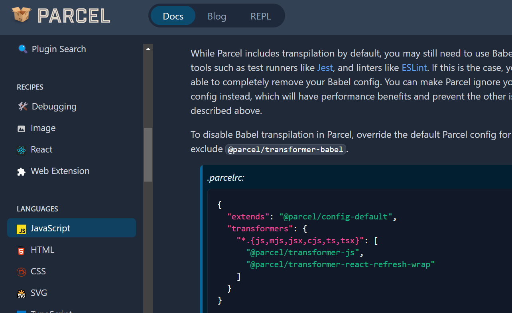

#### starting command :npx parcel index.html

# Redux Toolkit
- Install redux Toolkit ,React-Redux
- Build our Store
- Connect our store to our App
- Create Slice(cart slice)

# Types of testing(developer)
- Unit Testing - one component in isolation
- Integration Testing - multiple components (ex: if u click on search bar..then multiple componenets are involved with each other)
- End to End Testing (E2E) - (will start from user landing to user exit...stimulating how user will flow accross the app)

# Setting up Testing 
- Install React Test Library (`npm i -D @testing-library/react`)
- Install jest (`npm i -D jest`)
- Install babel dependencies (`npm install --save-dev @babel/preset-typescript`)
- Configure babel.config.cjs (from this link u can paste babel.cinfig.js file content https://jestjs.io/docs/getting-started)
- Configure .parcelrc to disable default babel configuration.(https://parceljs.org/languages/javascript/#babel)

- Initialize jest `npx jest --init`
 ### follow below steps after that
  >>no
  >> jsdom (env)
  >>yes
  >>yes

- Configure jsdom package
`npm install --save-dev jest-environment-jsdom`

# Create test files
1. Create a folder __tests__ any where in u are create app and place files in this folder or Create .test.js/ts or .spec.js/ts files 

# while writing test case
- Install `npm i @babel/preset-react` - to render compoenents in test js files
- Include @babel/preset-react in bable config file
- Install `npm i -D @testing-library/jest-dom`
- import "@testing-library/jest-dom" in your test file
- create watch-test in scripts of pakcage.json and run `npm run watch-test`. This command will automatically run tests once there is an update in test files. No need to run npm run test again and again. 

Dunder method -- > __name__